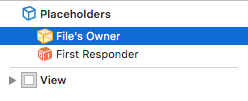
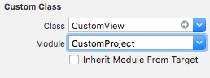
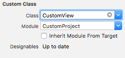

# XibViewKit

[](https://github.com/Carthage/Carthage)
[](https://travis-ci.org/varvet/XibViewKit)
[](https://codeclimate.com/github/varvet/XibViewKit/maintainability)

## Installation

### Carthage

Make the following entry in your Cartfile:

```
github "varvet/XibViewKit"
```

Then run `carthage update`.

## Usage

You will new to create a .xib file with a view in it. Then select the file owner in the document outline.



Map the file owner to the custom class.



Implement the custom class and make it be a subclass of `XibView`.  

```swift
import UIKit
import XibViewKit

@IBDesignable
class CustomView: XibView {
    @IBOutlet weak var title: UILabel!
    @IBOutlet weak var detail: UILabel!
    @IBOutlet weak var graphic: UIImageView!
}
```

Now in your your storyboard file you can set any view to your custom class and it should appear in the interface builder and load automatically. 


